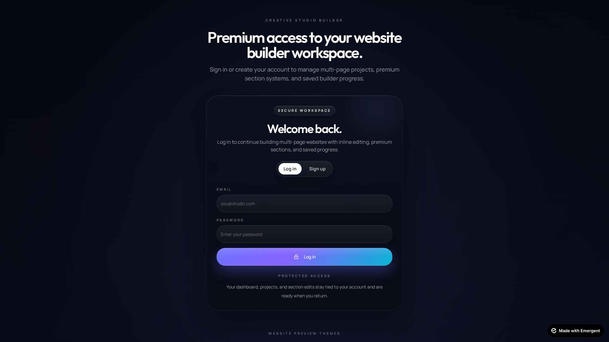
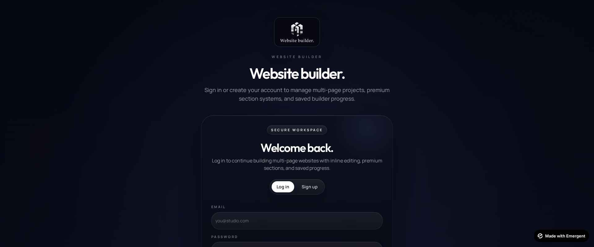
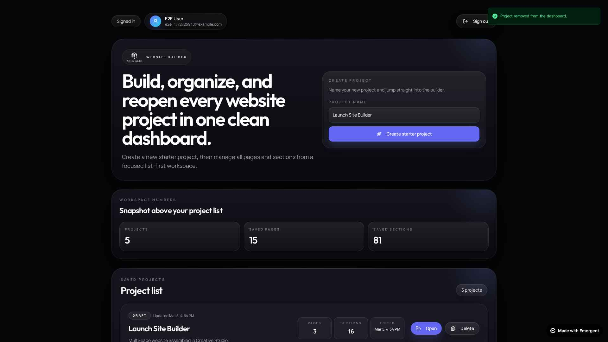
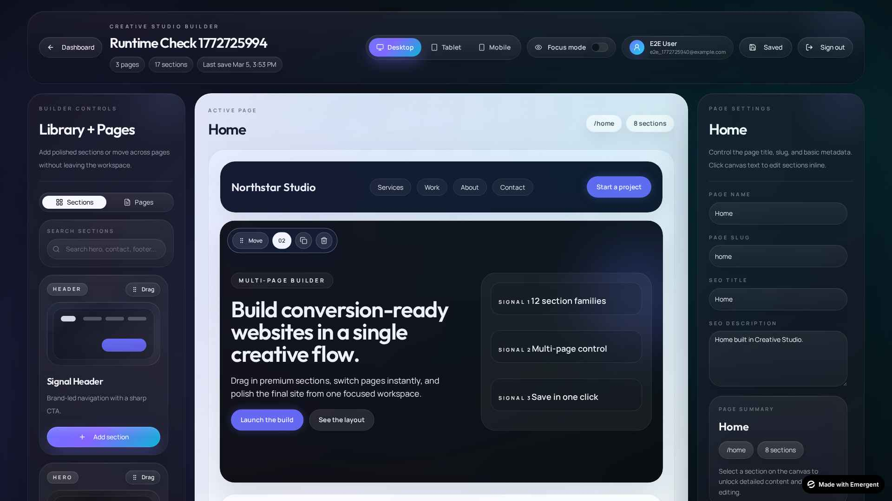
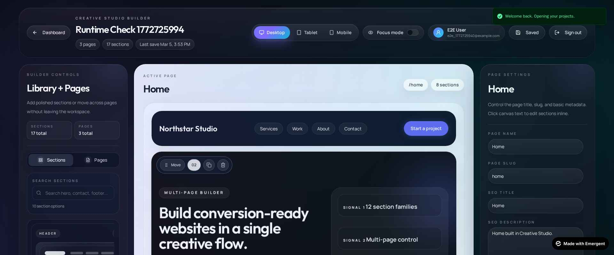
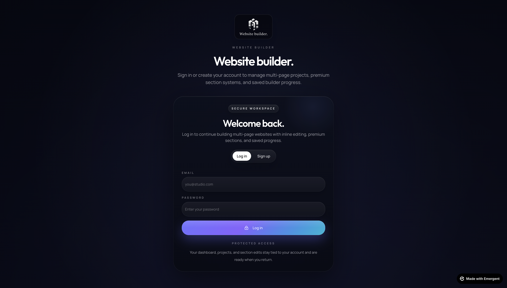
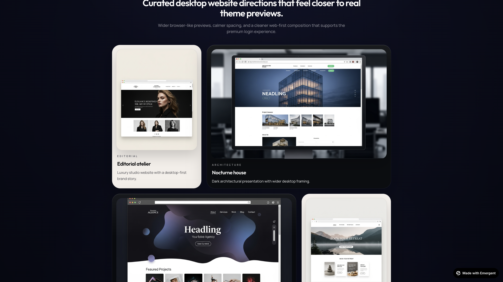
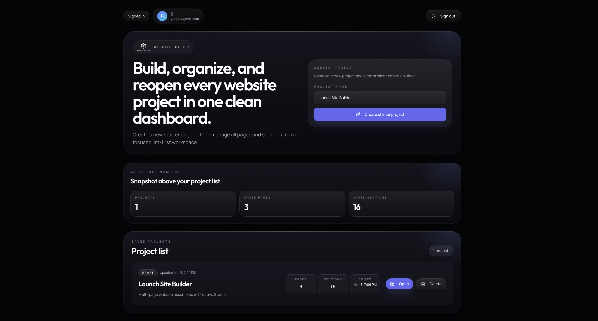
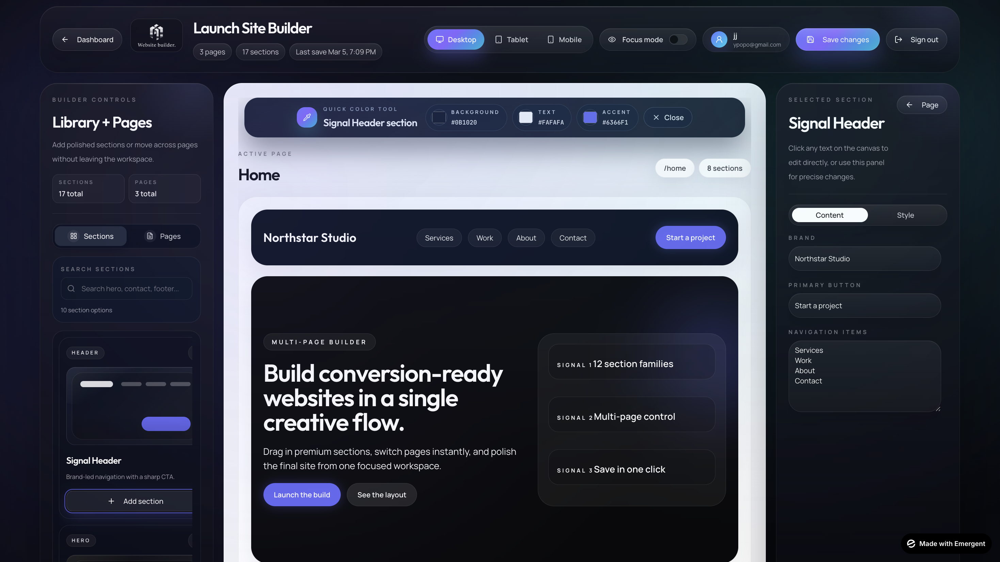

# Website Builder

Premium multi-page drag-and-drop website builder with auth, dashboard project management, section library, inline editing, style controls, and MongoDB persistence.

## Built with Emergent + GPT-5.4

This project was iterated end-to-end with Emergent + GPT-5.4 (product direction, UI refinements, bug fixes, UX polish, and testing loops).

### Representative Prompts (from this job)

- "I would like to create a drag and drop website builder tool. This will allow users to drag in from a library different section based designs, such as header, hero, call to actions, contact us, footers, testimonials, blogs, logos and a lot lot more. I would like an easy way that the user can click on one, add to page. Simple. The goal will be to get a website built quickly."
- "now Implement cleaner hover and make it good ,logic should be correct 
- "i want you to beautify the dashboard make the asthetic changes and it should look clean move the number to pannel above and list the project"
- "I want you to make tabs like this, simple, clean, and no overlapping — mix of library + pages. Make it more clean and good in terms of UI, I want you to beautify and make it polished."
- "Check again any missing colour or word is missing, maybe some same color background with same color text."

### Before / After Snapshots (Major UI Iterations)

- Auth Branding
  - Before: 
  - After: 

- Dashboard Layout
  - Before: 
  - After: 

- Builder Sidebar / Workspace Polish
  - Before: 
  - After: 

### Emergent Chat / Iteration Artifact

Per showcase requirement, this repo includes iteration snapshots showing the build progression with Emergent.

- Auth Page
  

- Auth Showcase Wall
  

- Dashboard
  

- Builder Workspace
  
