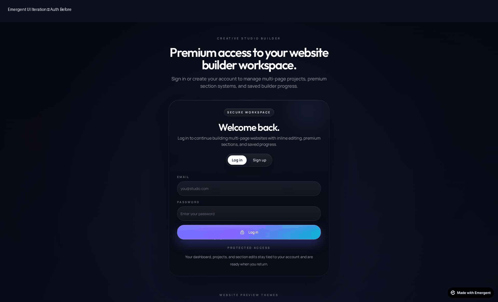

# Website Builder

Premium multi-page drag-and-drop website builder with auth, dashboard project management, section library, inline editing, style controls, and MongoDB persistence.

## Built with Emergent + GPT-5.4

This project was iterated end-to-end with Emergent + GPT-5.4 (product direction, UI refinements, bug fixes, UX polish, and testing loops).

### Representative Prompts (from this job)

- "fix runtime toast crash do this first and check my whole website also"
- "now Implement cleaner hover and make it good logic should be correct , also fix the colour logic because text is not visible"
- "i want you to beautify the dashboard make the asthetic changes and it should look clean move the number to pannel above and list the project"
- "in the auth i want you to generate the logo of my website and put the logo also it should look and classic"
- "check again any missing colour or word is missing maybe some same color background with same coor text"

### Before / After Snapshots (Major UI Iterations)

- Auth Branding
  - Before: 
  - After: 

- Dashboard Layout
  - Before: 
  - After: 

- Builder Sidebar / Workspace Polish
  - Before: 
  - After: 

### Emergent Chat / Iteration Artifact

Per showcase requirement, this repo includes a short iteration timelapse clip.

- Timelapse: 

If you want to attach direct Emergent chat screenshots, place them under ./showcase/chat/ and link them here.

Image files are stored directly in the repo folder: showcase/
